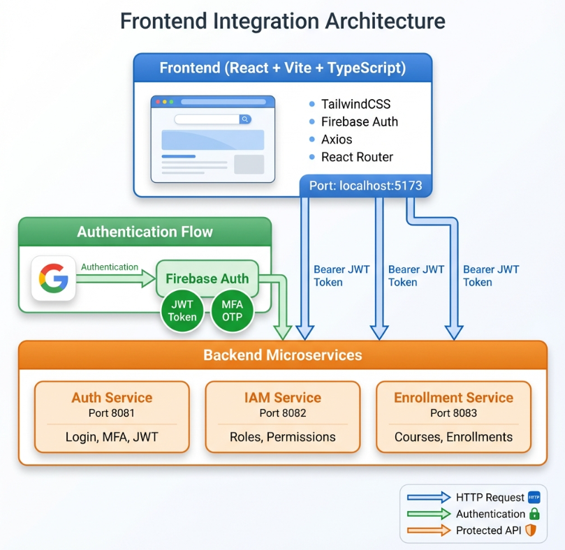

# Kaizen System - Microservices Architecture

Sistema de gestión universitaria basado en Microservicios, Clean Architecture y prácticas modernas de seguridad (JWT, MFA, RBAC).



## 🏗 Estructura del Proyecto

El sistema se divide en dos grandes componentes:

- **[Frontend](./frontend)**: Aplicación SPA desarrollada con React, Vite y TailwindCSS.
- **[Services Backend](./services-backend)**: Orquestador de microservicios Java/Spring Boot.
  - **[Auth Service](./services-backend/auth-service)**: Gestión de autenticación, MFA y JWT.
  - **[IAM Service](./services-backend/iam-service)**: Gestión de identidades, roles y permisos (RBAC).
  - **[Enrollment Service](./services-backend/enrollment-service)**: Gestión de cursos e inscripciones.

---

## 🛠 Configuración Inicial (Importante)

A diferencia de versiones anteriores, **no existe un archivo .env en la raíz**. Cada servicio (frontend y microservicios) gestiona sus propias variables de entorno basándose en su respectivo `.env.example`.

### 1. Base de Datos (Supabase)
El sistema utiliza **Supabase** (PostgreSQL) como proveedor de base de datos.
1. Crea un proyecto en Supabase.
2. Ejecuta el archivo SQL de inicialización para crear los esquemas (`auth_schema`, `iam_schema`, `enrollment_schema`), las tablas y los datos iniciales (roles y cursos).
   - El script se encuentra en: `services-backend/database/init-db.sql`
3. Asegúrate de obtener las credenciales de conexión (Host, User, Password, Port).

### 2. Variables de Entorno
Debes crear un archivo `.env` en cada una de las siguientes rutas, tomando como base el `.env.example` correspondiente:

- `frontend/.env`
- `services-backend/auth-service/.env`
- `services-backend/iam-service/.env`
- `services-backend/enrollment-service/.env`

> **Nota**: El `auth-service` requiere configuración adicional de **Firebase** (para verificación de tokens) y **Mailtrap** (para el envío de códigos MFA).

---

## 🚀 Despliegue

Para levantar el sistema completo, debe seguir este orden:

### Paso 1: Levantar Microservicios Backend
Ingresa a la carpeta de servicios y ejecuta docker-compose:
```bash
cd services-backend
docker compose up --build -d
```
Esto levantará el Auth Service (8081), IAM Service (8082) y Enrollment Service (8083).

### Paso 2: Levantar el Frontend
Ingresa a la carpeta del frontend y ejecuta docker-compose:
```bash
cd frontend
docker compose up --build -d
```
La aplicación estará disponible en `http://localhost:3000`.

---

## 🔐 Seguridad y Tecnologías

- **JWT (JSON Web Tokens)**: Firmados con HS256, expiración de 30 min.
- **MFA**: Autenticación de dos factores obligatoria vía Email (Mailtrap).
- **RBAC**: Control de acceso basado en roles (`admin`, `operator`, `student`).
- **Firebase Auth**: Utilizado en el frontend para la gestión de sesión y en el backend para validación.
- **Supabase**: Base de datos relacional con soporte para esquemas múltiples.

Para detalles específicos de cada microservicio, consulte los READMEs internos:
- [Documentación Auth Service](./services-backend/auth-service/README.md)
- [Documentación IAM Service](./services-backend/iam-service/README.md)
- [Documentación Enrollment Service](./services-backend/enrollment-service/README.md)
- [Documentación Frontend](./frontend/README.md)
